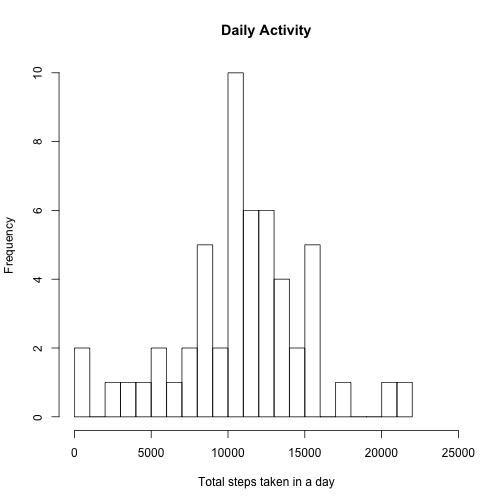
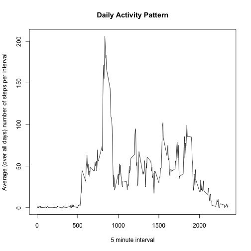
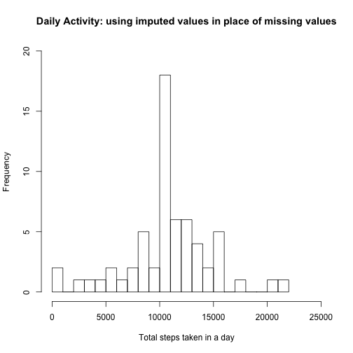
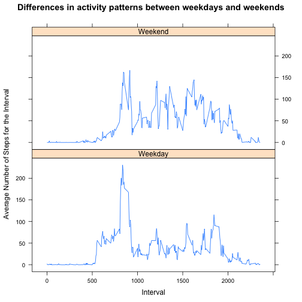

## Loading and preprocessing the data

```r
rm(list=ls())
unlink('activity.csv')
unzip('activity.zip')
activity <- read.csv('activity.csv', header = T, sep = ',')
activity$date <- as.Date(activity$date)
```

## What is mean total number of steps taken per day?

```r
daily_activity <- aggregate(activity$steps, list(activity$date), FUN = sum)
names(daily_activity) <- c('date', 'Total.Steps')
hist(daily_activity$Total.Steps, 
     xlab = 'Total steps taken in a day', 
     main = 'Daily Activity', 
     breaks = 25, xlim = c(0, 25000), ylim = c(0,10))
```

 

#### The average of the total number of steps per day:

```r
mean(daily_activity$Total.Steps, na.rm = T)
```

```
## [1] 10766.19
```

#### The median of the total number of steps per day:

```r
median(daily_activity$Total.Steps, na.rm = T)
```

```
## [1] 10765
```

## What is the average daily activity pattern?

```r
steps_per_interval_avgdoveralldays <- aggregate(activity$steps, list(activity$interval), FUN = mean, na.rm = T)
names(steps_per_interval_avgdoveralldays) <- c('interval', 'steps')
par(mfrow = c(1,1))
plot(steps_per_interval_avgdoveralldays$interval, steps_per_interval_avgdoveralldays$steps, type = 'l', 
     xlab = '5 minute interval', 
     ylab = 'Average (over all days) number of steps per interval', 
     main = 'Daily Activity Pattern')
```

 

```r
interval_with_max_avg_number_steps <- steps_per_interval_avgdoveralldays[
which(steps_per_interval_avgdoveralldays$steps == max(steps_per_interval_avgdoveralldays$steps, na.rm = T))
,'interval']
```
#### The interval with the maximum average numebr of steps:

```r
interval_with_max_avg_number_steps
```

```
## [1] 835
```

## Imputing missing values
#### Number of missing values:

```r
number_of_missing_values <- sum(is.na(activity$steps))
number_of_missing_values
```

```
## [1] 2304
```

#### New dataset: Replace missing values with the mean for that interval 

```r
activity_imputed <- merge(activity, steps_per_interval_avgdoveralldays, by.x = 'interval', by.y = 'interval')
activity_imputed <- activity_imputed[order(activity_imputed$date),]
index_of_missing_values <- is.na(activity_imputed$steps.x)
activity_imputed[index_of_missing_values, 'steps.x'] <- activity_imputed[index_of_missing_values, 'steps.y']
activity_imputed$steps.y <- NULL
names(activity_imputed) <- c("interval", "steps", "date")
head(activity_imputed)
```

```
##     interval     steps       date
## 1          0 1.7169811 2012-10-01
## 63         5 0.3396226 2012-10-01
## 128       10 0.1320755 2012-10-01
## 205       15 0.1509434 2012-10-01
## 264       20 0.0754717 2012-10-01
## 327       25 2.0943396 2012-10-01
```

```r
daily_activity_imputed <- aggregate(activity_imputed$steps, list(activity_imputed$date), FUN = sum)
names(daily_activity_imputed) <- c('date', 'Total.Steps')
hist(daily_activity_imputed$Total.Steps, 
     xlab = 'Total steps taken in a day', 
     main = 'Daily Activity: using imputed values in place of missing values', 
     breaks = 25, xlim = c(0, 25000), ylim = c(0,20))
```

 


#### The average of the total number of steps per day (using imputed values in place of missing values):

```r
mean(daily_activity_imputed$Total.Steps, na.rm = T)
```

```
## [1] 10766.19
```

#### The median of the total number of steps per day (using imputed values in place of missing values):

```r
median(daily_activity_imputed$Total.Steps, na.rm = T)
```

```
## [1] 10766.19
```
#### Using imputed values in place of missing values did not change the mean, but changed the median to become equal to the mean.

## Are there differences in activity patterns between weekdays and weekends?

```r
activity_imputed$day.of.week <- weekdays(activity_imputed$date)
activity_imputed$type.of.day <- 'Weekday'
activity_imputed$type.of.day[activity_imputed$day.of.week == 'Sunday' | activity_imputed$day.of.week == 'Saturday'] <- 'Weekend'
activity_imputed$type.of.day <- as.factor(activity_imputed$type.of.day)
table(activity_imputed$type.of.day)
```

```
## 
## Weekday Weekend 
##   12960    4608
```

```r
str(activity_imputed)
```

```
## 'data.frame':	17568 obs. of  5 variables:
##  $ interval   : int  0 5 10 15 20 25 30 35 40 45 ...
##  $ steps      : num  1.717 0.3396 0.1321 0.1509 0.0755 ...
##  $ date       : Date, format: "2012-10-01" "2012-10-01" ...
##  $ day.of.week: chr  "Monday" "Monday" "Monday" "Monday" ...
##  $ type.of.day: Factor w/ 2 levels "Weekday","Weekend": 1 1 1 1 1 1 1 1 1 1 ...
```

```r
avg_over_type_of_day_number_of_steps_taken_by_interval <- aggregate(activity_imputed$steps, list(activity_imputed$type.of.day, activity_imputed$interval), FUN = mean)
names(avg_over_type_of_day_number_of_steps_taken_by_interval) <- c('type.of.day', 'interval', 'steps')
str(avg_over_type_of_day_number_of_steps_taken_by_interval)
```

```
## 'data.frame':	576 obs. of  3 variables:
##  $ type.of.day: Factor w/ 2 levels "Weekday","Weekend": 1 2 1 2 1 2 1 2 1 2 ...
##  $ interval   : int  0 0 5 5 10 10 15 15 20 20 ...
##  $ steps      : num  2.2512 0.2146 0.4453 0.0425 0.1732 ...
```

```r
library(lattice)
xyplot(steps~interval|factor(type.of.day), data = avg_over_type_of_day_number_of_steps_taken_by_interval,
           type = 'l',
           xlab = 'Interval',
           ylab = 'Average Number of Steps for the Interval',
           main = 'Differences in activity patterns between weekdays and weekends',
           layout=c(1,2))
```

 

```r
unlink('activity.csv')
```
